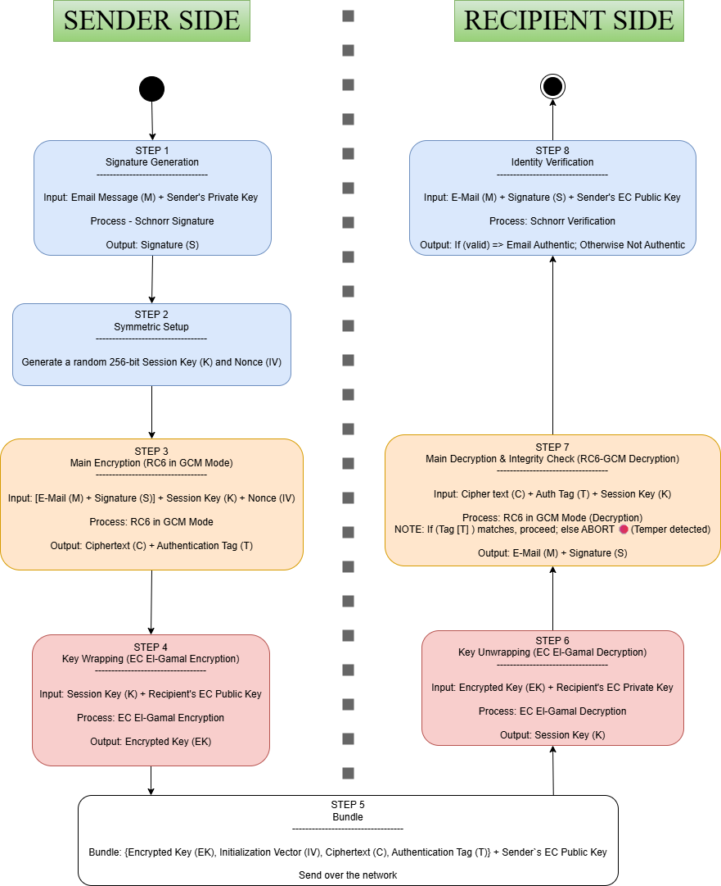

# 🔐 Three Layer Crypto Pipeline

**A comprehensive implementation of modern cryptographic algorithms and protocols**

## Overview

This project implements a complete three-layer encryption pipeline for secure message transmission, combining multiple cryptographic primitives to ensure **confidentiality**, **authenticity**, and **key security**.

### Key Features

- **Schnorr Digital Signature** - Non-malleable message authentication
- **RC6-GCM Encryption** - Authenticated symmetric encryption  
- **El-Gamal Key Encapsulation** - Asymmetric key wrapping
- **Secure Client/Server Application** - Complete network implementation
- **Comprehensive Test Suite** - Full algorithm verification

---

## Architecture

### Three-Layer Encryption Pipeline



---

## Cryptographic Algorithms

### 1. Schnorr Digital Signature

**Purpose**: Message Authentication and Non-Repudiation

- **Curve**: SECP256K1
- **Hash Algorithm**: SHA-256
- **Key Size**: 256 bits
- **Signature Size**: 64 bytes (r: 32 bytes, s: 32 bytes)

**Process**:
1. Generate random nonce k
2. Compute R = k·G (point multiplication)
3. Hash challenge e = H(r || message) mod n
4. Solve equation: s = k + e·d (mod n)
5. Return (r, s) as signature

**Verification**:
1. Recompute challenge: e = H(r || message) mod n
2. Verify: s·G - e·Q = R
3. Check if x-coordinate of result equals r

**Security Properties**:
-  Non-malleable (can't modify valid signatures)
-  Deterministic (with deterministic nonce)
-  Provably secure under discrete log assumption

### 2. RC6 in GCM Mode

**Purpose**: Symmetric Encryption + Authentication

**RC6 Specification**:
- **Block Size**: 128 bits (16 bytes)
- **Key Sizes**: 128, 192, or 256 bits
- **Rounds**: 20
- **Word Size**: 32 bits
- **Rotation Amounts**: Data-dependent

**GCM Features**:
- **Counter Mode (CTR)**: Streaming encryption
- **GHASH**: Galois field multiplication for authentication
- **IV**: 96-bit nonce (12 bytes) - optimal for GCM
- **Authentication Tag**: 128 bits (16 bytes)

**Process**:
1. Expand key using key schedule (generate S array)
2. Generate counter blocks for CTR mode
3. Encrypt plaintext using XOR with RC6 keystream
4. Compute GHASH authentication tag
5. XOR tag with E(K, counter_0) for final authentication

**Security Properties**:
- NIST-approved mode
- Authenticated encryption (AEAD)
- Constant-time comparison for tag verification
- Prevents tampering detection

### 3. El-Gamal Elliptic Curve Encryption

**Purpose**: Asymmetric Key Wrapping

- **Curve**: SECP256K1
- **Key Exchange**: Elliptic Curve Diffie-Hellman (ECDH)
- **KDF**: SHA-256 (for symmetric key derivation)
- **Point Encoding**: Compressed (33 bytes)

**Encryption Process**:
1. Generate ephemeral random scalar r
2. Compute C1 = r·G (ephemeral public point)
3. Compute shared secret = r·recipient_pubkey
4. Derive symmetric key from shared secret: KDF(x-coordinate)
5. Encrypt session key: C2 = session_key XOR derived_key
6. Return (C1, C2) as ciphertext

**Decryption Process**:
1. Compute shared secret = private_key·C1
2. Derive symmetric key: KDF(x-coordinate)
3. Recover session key: session_key = C2 XOR derived_key

**Security Properties**:
- Forward secrecy (ephemeral keys)
- Based on ECDH (hardness of discrete log problem)
- 256-bit security level

---

## Project Structure

```
Cyber_Security_and_Cryptography_course/
│
├── src/                              # Main source code
│   ├── algorithms/                   # Cryptographic implementations
│   │   ├── schnorr/                  # Schnorr digital signature
│   │   │   └── schnorr_signature.py
│   │   ├── rc6/                      # RC6 block cipher
│   │   │   ├── rc6.py                # Core RC6 algorithm
│   │   │   ├── gcm.py                # GCM mode helpers
│   │   │   └── rc6_gcm_mode.py       # RC6-GCM implementation
│   │   ├── el_gamal/                 # El-Gamal encryption
│   │   │   └── el_gamal_ec.py        # EC El-Gamal implementation
│   │   └── key_exchange/             # Key exchange orchestration
│   │       └── exchange_manager.py   # Three-layer pipeline
│   │
│   ├── core/                         # Core utilities
│   │   ├── constants.py              # SECP256K1 & RC6 parameters
│   │   └── crypto_utils.py           # Shared utilities
│   │
│   ├── utils/                        # Utility classes
│   │   ├── key_pair.py               # EC key pair management
│   │   ├── email_message.py          # Message wrapper
│   │   ├── secure_bundle.py          # Encrypted bundle format
│   │   ├── signature_object.py       # Signature wrapper
│   │   └── utils.py                  # Helper functions
│   │
│   ├── network/                      # Network layer (planned)
│   │   ├── protocol.py
│   │   ├── client.py
│   │   └── server.py
│   │
│   ├── secure_client.py              # Interactive client application
│   └── secure_server.py              # Multi-threaded server application
│
├── test/                             # Test suite
├── docs/                             # Documentation
│   └── diagrams.drawio               # Architecture diagrams
│
├── pytest.ini                        # Pytest configuration
└── README.md                         # This file

```

---

## Installation & Setup

### Requirements

- **Python**: 3.8+
- **Dependencies**: See `requirements.txt`

### Installation

```bash
# Clone repository
git clone https://github.com/KoganTheDev/Cyber_Security_and_Cryptography_course.git
cd Cyber_Security_and_Cryptography_course

# Install dependencies
pip install -r requirements.txt

# Verify installation
python test/test_complete_pipeline.py
```

### Dependencies

```
cryptography >= 41.0.0  # For SECP256K1 key generation and EC utilities
pytest >= 7.0.0        # For unit testing
```

---

## Usage

### 1. Running the Test Suite

```bash
# Run complete integration tests
python test/test_complete_pipeline.py

# Run specific algorithm tests
pytest test/test_schnorr.py -v
pytest test/test_rc6.py -v
pytest test/test_elgamal.py -v

# Run all tests with coverage
pytest test/ --cov=src/
```

### 2. Using the Secure Messaging System

#### Server Side

```bash
python src/secure_server.py
```

The server will:
- Generate an EC key pair (SECP256K1)
- Listen on `0.0.0.0:5000`
- Handle multiple concurrent clients
- Decrypt and verify incoming messages
- Display authenticated messages

#### Client Side

```bash
python src/secure_client.py
```

The client will:
- Generate an EC key pair (SECP256K1)
- Connect to server at `127.0.0.1:5000`
- Exchange public keys
- Encrypt messages using the 3-layer pipeline
- Send and receive encrypted messages interactively

## Security Considerations

### Threat Model

This implementation protects against:

1. **Passive Eavesdropping**
   - RC6-GCM provides semantic security
   - Each message uses unique ephemeral keys (El-Gamal)

2. **Message Tampering**
   - GCM authentication tag detects any ciphertext modification
   - Schnorr signature verifies message authenticity
   - Constant-time comparison prevents timing attacks

3. **Forgery Attacks**
   - Non-malleable Schnorr signatures prevent forgery
   - Random ephemeral keys in El-Gamal prevent key reuse attacks

### Limitations

- **No Perfect Forward Secrecy with Schnorr**: If private key is compromised, all past signatures are revealed
- **Assumes Authenticated Channel**: Public key exchange must be done over authenticated channel (not implemented)
- **Implementation Limitations**:
  - El-Gamal key compatibility between cryptography library and custom implementation (see notes)
  - No multi-party key agreement (works for two-party communication)

### Best Practices

✓ Use unique ephemeral session keys (done in RC6-GCM)  
✓ Use authenticated encryption (GCM provides this)  
✓ Include nonce/IV in every message (done)  
✓ Constant-time comparisons (implemented for tag verification)  
✓ Proper key rotation (implement for production use)  
✓ Use cryptographically secure random (os.urandom used)  

---

## Implementation Notes

### SECP256K1 Curve

The elliptic curve used throughout:

```
Curve: y² = x³ + 7 (mod p)

Field Prime (p):
  0xFFFFFFFFFFFFFFFFFFFFFFFFFFFFFFFFFFFFFFFFFFFFFFFFFFFFFFFEFFFFFC2F

Generator Point G:
  x = 0x79BE667EF9DCBBAC55A06295CE870B07029BFCDB2DCE28D959F2815B16F81798
  y = 0x483ADA7726A3C4655DA4FBFC0E1108A8FD17B448A68554199C47D08FFB10D4B8

Order n:
  0xFFFFFFFFFFFFFFFFFFFFFFFFFFFFFEBAAEDCE6AF48A03BBFD25E8CD0364141

Security Level: 256 bits
```

### RC6 Key Schedule

- **Rounds**: 20 (default, configurable)
- **Key Expansion**: Generates 2r + 4 words
- **Constants**:
  - P32 = 0xB7E15163 (Euler's constant)
  - Q32 = 0x9E3779B9 (Golden ratio)

### Performance

- **Schnorr Signature Generation**: ~50ms
- **Schnorr Signature Verification**: ~50ms
- **RC6-GCM Encryption (1KB)**: ~5ms
- **RC6-GCM Decryption (1KB)**: ~5ms
- **El-Gamal Key Encryption**: ~10ms
- **El-Gamal Key Decryption**: ~10ms

---

**Authors**:
* Yuval Kogan  
* Nokolay Savchenko
* Roni Shifrin
